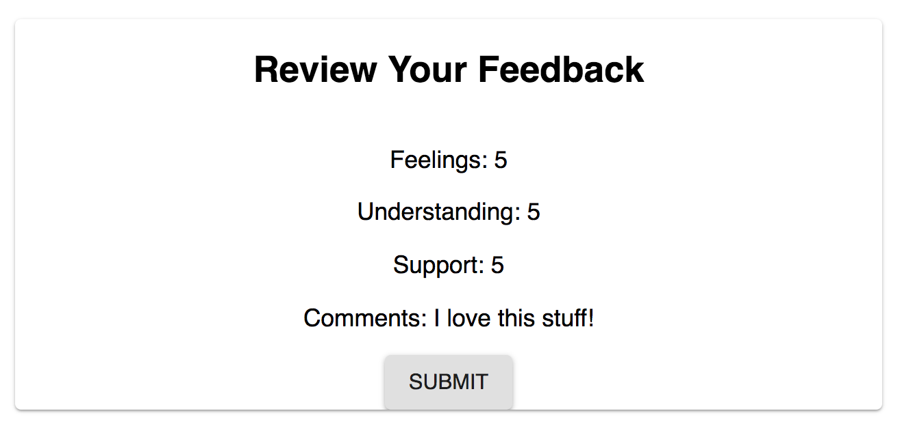

# Weekend Redux Feedback Loop

For this assignment, you will be creating a reflection/feedback form modeled after Prime's system. Feedback will be collected over 4 views. In a separate review page, display the current feedback values and a submit button. and when all steps are complete, your app will save the feedback in the database.

## Setup

Create your database and tables using the provided `database.sql` file. Install package dependencies and start the server.

```shell
npm install
npm run server
```

Now that the server is running, open a new terminal tab with `cmd + t` and start the react client app.

```shell
npm run client
```

## Add New Feedback

> NOTE: As a baseline requirement, you must use Redux to store your data across views.

Create a multi-part form that allows users to leave feedback for today. 
There will be 4 views for the form parts.

The parts, in order:
- How are you feeling today?

- How well are you understanding the content?

- How well are you being supported?

- Any comments you want to leave?


While there is no nav bar, each part of the form should be at its own route. 

Clicking next should move the user to the appropriate step in the process.

## The Review Component

After collecting the 4 feedback parts, the app will allow the user to review their feedback. They should be able to see the values they added earlier. Users are not able to change their input on this step or go back for Base Mode. 



## Submit the Feedback

The `Review` step needs to have a submit button which will be clicked on to actually submit the completed feedback to the server.

When the submit button is clicked, save the submission in the database. 

The user then should see a submission success page. They can then click the button to take a new survey, which needs to reset all the data and go back to the first step.


## Testing Requirements

The button on each page that moves you to the next page needs `data-testid="next"` on every page. This includes the "review" page's *Submit* button and the "thank you" page's *Leave New Feedback* button!

The input used to collect the scores/feedback on each page needs a `data-testid="input"`.

The tests expect the app to load at the feeling step. This likely means your client side `/` route is the feeling step. Having a `Welcome` page into the mix will break the tests.

Each step of the process needs to have the appropriate label. So if you are on the feeling step, the text of `feeling` must be on the page someplace. Same for all views: feeling, understanding, support, comments, review, thank you. This helps the tests know what step of the form we are on.

## Stretch Goals

> NOTE: These stretch goals are intended to be completed in order.

### Input Validation

Each step should only allow the user to advance to the next step if a score was provided. Be sure to tell the user in some way that a value must be provided.

The `Comments` step does not need to be validated, an empty value is okay.

> NOTE: This will likely break some of the tests! You need to fix them too.

### Update Scores

Allow the user to go back to a previous step and change their score. You still need to disallow empty values!

### Styling

Improve the styling of the app using Material-UI. This might include cards, snack bars, buttons, a nav bar, icons, and/or a theme.

> NOTE: If you change the inputs to use MUIs TextField component, you will need to do research here [MUI TextField](https://mui.com/material-ui/api/text-field) in order to correctly use the `data-testid="input"` testing requirement.

### Admin Section

- Display all of the existing feedback at the route `/admin`. The most recently added feedback should appear at the top of the list. Allow the user to delete existing feedback. Prompt the user to confirm prior to deleting the feedback from the database.


- Add the ability to flag an existing feedback entry for further review on the /admin view.

### Deploy

Deploy your project to Heroku. 
